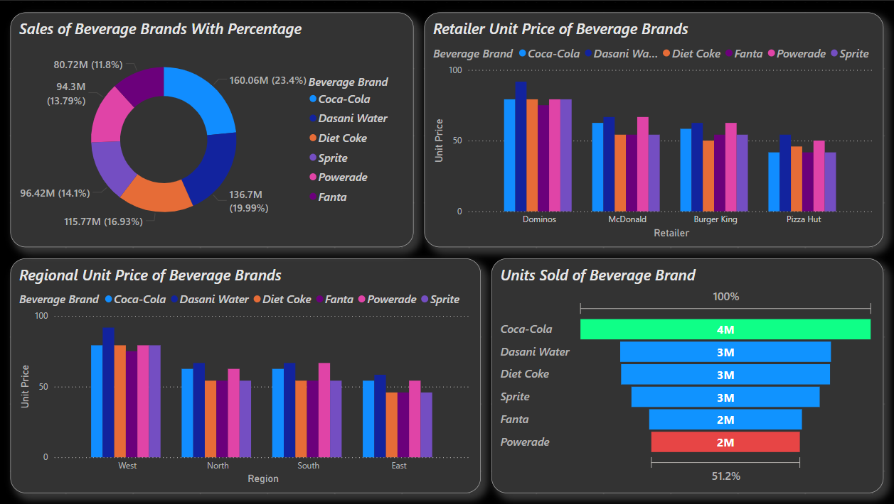
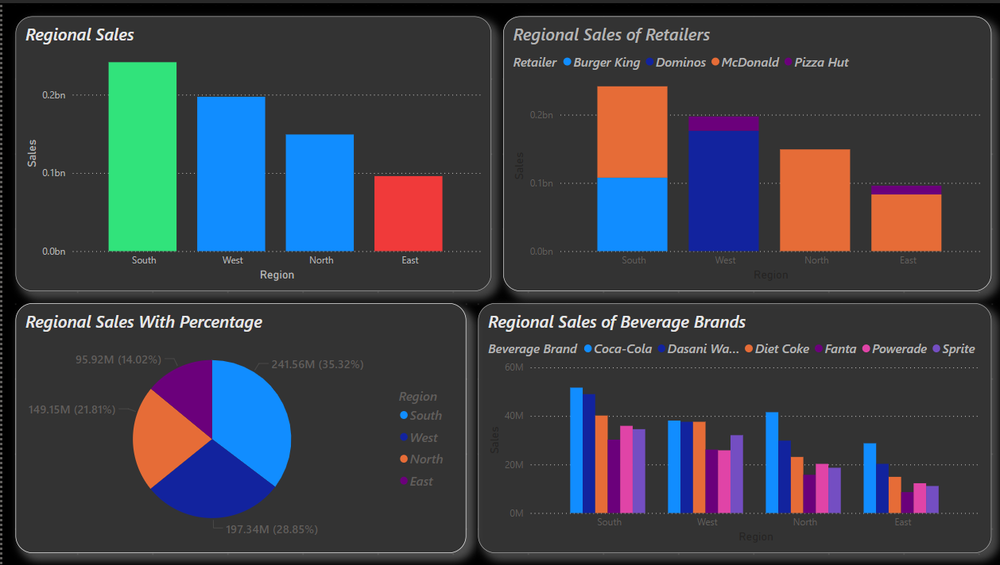
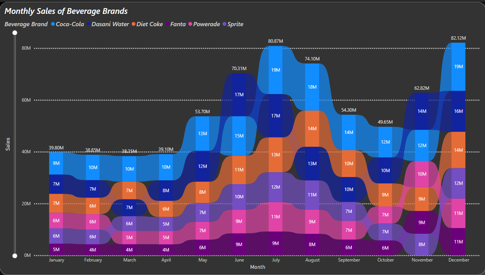

# Power BI Data Visualization Project

This project demonstrates various data transformation and visualization techniques using Power BI. The screenshots below highlight different stages and features of the Power BI dashboards created.

## Features

- Data preprocessing with transformations such as merging columns, custom sorting, and text casing.
- Insightful visualizations like line charts and KPI indicators.
- Organized dashboards for business insights and seasonal analysis.
- Clean, professional layout for clear communication of data stories.

## Screenshots

  
*Dashboard with key indicators and visuals*

  
*Detailed line chart view of data over time*

  
*Seasonal trend analysis and pattern identification*

  
*Data preparation and transformation steps*

  
*Custom sorting and enhanced data representation*

## How to Use

1. Open Power BI Desktop.
2. Load your dataset.
3. Apply similar transformations and layout to replicate the structure.
4. Customize visuals and filters as needed to match your business context.

---

**Author:** Sanjay | **Company:** Xenotrix Technologies  
**Date:** May 2025
